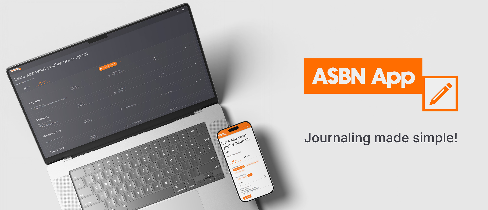

# ASBN App
A Blazor Web Assembly app that allows you to write your mandatory apprenticeship report book with ease. The aim is to be able to quickly add a note for a day before forgetting about it, and when the time has come, you can export a ready-to-go pdf with the information you entered sometime before.

The app uses a custom api to handle storing the data in an SQL database. Authentication is handled using ASP.NET Core Identity. There's also a legacy version available that uses JSON to store data - simply check-out "legacy-version" to access that (there's no support for this version, use at your own risk).

## Self Hosting

> The simplest way to use the app is through here: [ASBN App](https://asbn.app)

You can fully self host this application - there are docker templates included in the repository.
In order to deploy your own instance, simply clone the repository to a folder on your docker machine:

```bash
git clone https://github.com/mr-woodapple/ASBNApp.git
```

Then, create a `.env` file on your machine with the following entries:

```
API_CONNECTIONSTRING="Server=sql-server,1433;Database=asbnapp-sql-database;User=sa;Password=<replace-with-super-secure-password>;Encrypt=False;TrustServerCertificate=True;"
DB_SA_PASSWORD="<replace-with-super-secure-password>"
FE_APIURL="<replace-with-your-frontend-url>"
```

Once you have these in place, you can spin up the app like so (make sure you're in the repositories root directory, where the `compose.yml` is):

```bash
docker compose up --build -d
```

## Contributing
PRs welcome! Looking forward to your ideas / bugfixes, whatever you may wanna do. :)

## License
MIT © mr-woodapple 2023

## 💕 Credits
Many thanks to the people behind these packages that made my life a lot easier! 

- [Blazor.FileSystemAccess](https://github.com/KristofferStrube/Blazor.FileSystemAccess) by Kristoffer Strube
- [PDFsharp](https://github.com/empira/PDFsharp) by the folks behind empira
- [Blazored LocalStorage](https://github.com/Blazored/LocalStorage)
- [MudBlazor](https://mudblazor.com/)
- [PrettyBlazor](https://github.com/hassanhabib/PrettyBlazor)