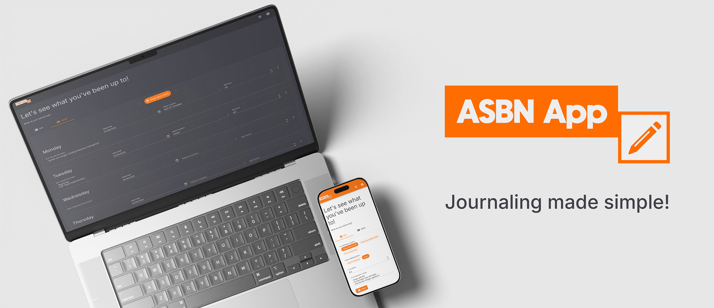

# ASBN App
A Blazor Web Assembly app that allows you to write your mandatory apprenticeship report book with ease. The aim is to be able to quickly add a note for a day before forgetting about it, and when the time has come, you can export a ready-to-go pdf with the information you entered sometime before.

The app uses a custom api to handle storing the data in an SQL database. Authentication is handled using ASP.NET Core Identity. There's also a legacy version available that uses JSON to store data - simply check-out "legacy-version" to access that (there's no support for this version, use at your own risk).

## Self Hosting

> The simplest way to use the app is through here: [ASBN App](https://asbn.woodapple.dev)

You can fully self host this application - there are docker templates included in the repository.
In order to deploy your own instance, simply create a new `compose.yaml` file in a folder of your choice with the following content:

```yaml
services:
  asbnapp-frontend:
    container_name: ASBNApp.Frontend
    image: ghcr.io/mr-woodapple/asbnapp-frontend:release
    environment:
      ApiUrl: ${FRONTEND_URL}
    ports:
      - "7133:80"
    depends_on:
      - asbnapp-api # Ensures the API starts before the frontend tries to call it
    restart: unless-stopped

  asbnapp-api:
    container_name: ASBNApp.DataAPI
    image: ghcr.io/mr-woodapple/asbnapp-backend:release
    environment:
      ConnectionStrings__DatabaseConnection: ${API_CONNECTIONSTRING}
      FrontendUrl: ${FRONTEND_URL}
    depends_on:
      - sql-server # Ensures the database starts before the API
    restart: unless-stopped

  sql-server:
    container_name: ASBNApp.SqlServer
    image: mcr.microsoft.com/mssql/server:2022-latest
    environment:
      ACCEPT_EULA: "Y"
      MSSQL_SA_PASSWORD: ${DB_SA_PASSWORD}
    volumes:
      - sqlData:/var/opt/mssql
    restart: unless-stopped

volumes:
  sqlData:

```

Then, create a `.env` file on your machine with the following entries:

```
# Database related config
API_CONNECTIONSTRING=Server=sql-server,1433;Database=asbnapp-sql-database;User=sa;Password=<replace-with-super-secure-password>;Encrypt=False;TrustServerCertificate=True;
DB_SA_PASSWORD=<replace-with-super-secure-password>

# Frontend url, under which you're accessing the app
FRONTEND_URL=https://<replace-with-your-ip-or-domain>:7133
```

Once you have these in place, you can spin up the app like so:

```bash
docker compose up
```

## Contributing
PRs welcome! Looking forward to your ideas / bugfixes, whatever you may wanna do. :)

## License
MIT © mr-woodapple 2023

## 💕 Credits
Many thanks to the people behind these packages that made my life a lot easier! 

- [Blazor.FileSystemAccess](https://github.com/KristofferStrube/Blazor.FileSystemAccess) by Kristoffer Strube
- [PDFsharp](https://github.com/empira/PDFsharp) by the folks behind empira
- [Blazored LocalStorage](https://github.com/Blazored/LocalStorage)
- [MudBlazor](https://mudblazor.com/)
- [PrettyBlazor](https://github.com/hassanhabib/PrettyBlazor)