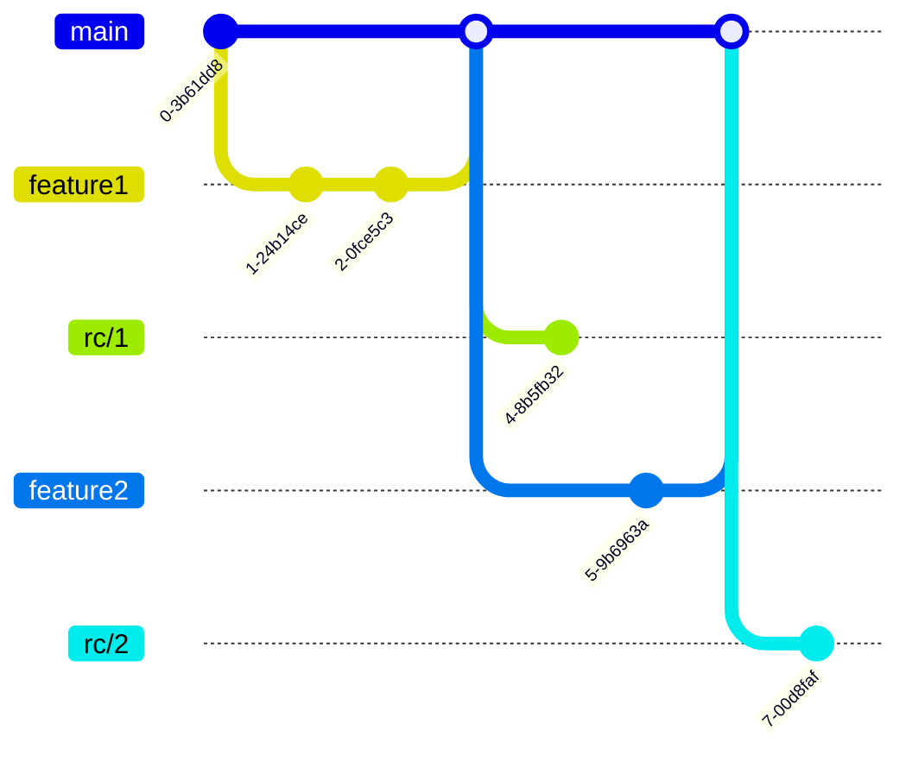

# TODO for ASBN App
This is the markdown todo file for the ASBN App project.

## General

- [ ] Navbar Design (define ui structure in MainLayout file)
- [ ] Nav link component (active / inactive)
- [ ] Save data dialog (update with state from backend)
- [ ] Date Picker (as a pop-up / overlay)
- [ ] Component pill as a selector (used on DailyStart for example)
- [ ] Info message if the app can't be used on my device (not supported by browser / device)

## Start Page

Split into a weekly and a daily view.

- [ ] Component for the main header ('let's see what you've been up to' for example)
- [ ] Component Weekly / Daily view switcher

#### Weekly page:
  - [ ] Week selector -> opens date picker on click
  - [ ] Overall page ui
  - [ ] Day component (incl. Day, Notes, Location)
  - [ ] Show date picker on click on a date (not everyone might be working Mon - Fri)
  - [ ] Check if data for the current week is present at loading -> load that
  - [ ] Track changes, show "Update" button if user changed existing data / show "Save" button for first input

#### Daily page:
  - [ ] Page ui
  - [ ] Check if data for the current day is present in the local .JSON -> load that
  - [ ] show date picker when user clicks on "Pick different date", use that value going forward
  - [ ] Get values for date pickers, display them
  - [ ] Get values for work location from JSON
  - [ ] Track changes, show "Update" button if user changed existing data / "Save" button for first input

## Export Page 

Let's the user create and sign the PDFs, save them locally.

- [ ] Overall page ui/layout
- [ ] Display pill selector with current week (with next and prev one) & dates of that week
- [ ] Generate pdf from selected week
- [ ] Preview window (optional!)
- [ ] Read MyCard data (get name)
- [ ] Create signature image (close to the Telekom sisignature UI)

## Settings Page 

- [ ] Overall UI
- [ ] Read/Write user job from JSON -> select from a predefined list
- [ ] Read/Write user locations/hours, add new entries
- [ ] Read/Write user legal representitive
- [ ] Read/Write user company & school

## Backend

- [ ] C# Object Entry -> Date, Location?, Hours?, Notes?
- [ ] C# Object User -> Name, Job, Locations/Working hours, LegalRepresentitive?, CompanyName?, SchoolName?
- [ ] Create .json files on the users system
- [ ] Read/Write files on the users system using the FileSystemAccess API (helpful? https://github.com/KristofferStrube/Blazor.FileSystemAccess)
- [ ] Get username from the myCard, use that on the document where it says "name"
- [ ] Store user settings in JSON file
- [ ] Get save state, update status bar with current save state
- [ ] Sign PDF files  
- [ ] Use exisiting pdf template, index available input fields

